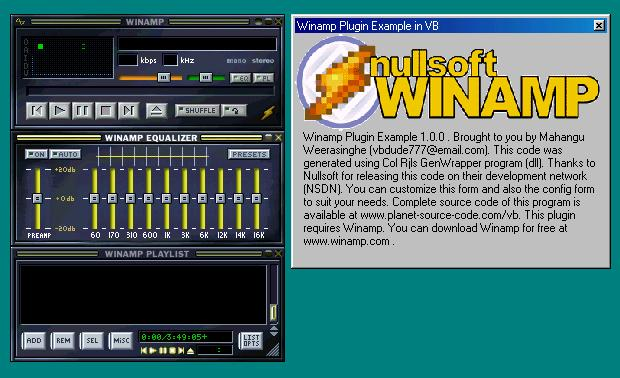



## Winamp Plugin Example \(Write Winamp Plugins in VB\)

### Description

This code demonstrates how to create plugins for the popular Mp3 player Winamp. The code contains template files and the code is also very well commented. The code was written using the GenWrapper.dll by Col Rjl which was distributed via NSDN (by Nullsoft). Upto now Winamp Plugins could be written only in C. But just the other night I was checking out the NSDN website and I found this code!! This is just the first version... I'll make some great looking plugins soon. This one just demonstrates how to make a plugin DLL that can be plugged into Winamp!
 
### More Info
 
Everything you need is supplied with the code. Be sure to register the type library. Also be sure to read the Readme file! I have included both the compiled version (2 dlls - 1 is the plugin, the other is the GenWrapper dll). I have also included the complete source code! Please post any comments or suggestions so I can improve this code!

Although this was coded in VB6 it should work in VB 5 too!!!

             |
---                |---
**Submitted On**   |2000-11-18 12:34:48
**By**             |[Mahangu](https://github.com/Planet-Source-Code/PSCIndex/blob/master/ByAuthor/mahangu.md)
**Level**          |Advanced
**User Rating**    |4.3 (13 globes from 3 users)
**Compatibility**  |VB 5\.0, VB 6\.0
**Category**       |[Sound/MP3](https://github.com/Planet-Source-Code/PSCIndex/blob/master/ByCategory/sound-mp3__1-45.md)
**World**          |[Visual Basic](https://github.com/Planet-Source-Code/PSCIndex/blob/master/ByWorld/visual-basic.md)
**Archive File**   |[CODE\_UPLOAD1180511182000\.zip](https://github.com/Planet-Source-Code/mahangu-winamp-plugin-example-write-winamp-plugins-in-vb__1-12896/archive/master.zip)

